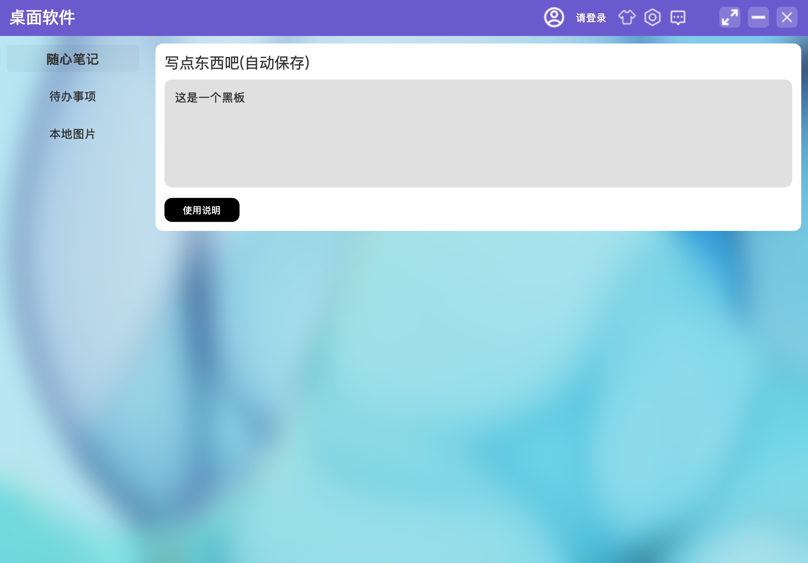
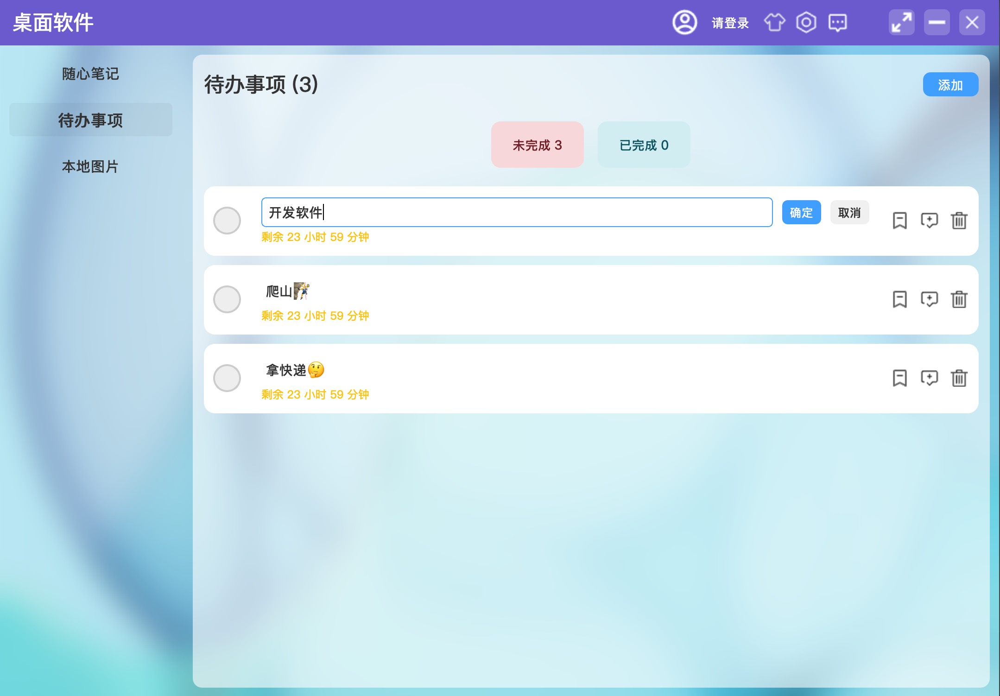
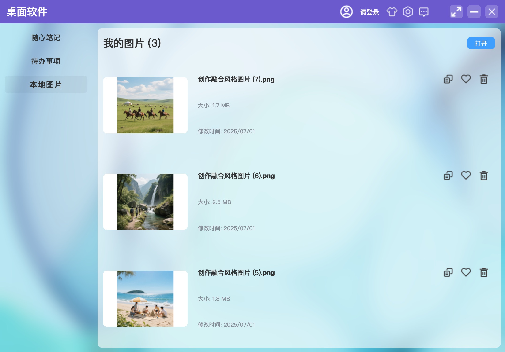

# PySide6 app framework

# 安装库
```shell
pip install app-page
```
# 模块说明
- core        程序核心模块
- animation   动画模块
- plugins     插件模块
- utils       工具模块
- example     示例页面，可参考学习或直接使用

# 使用案例
```python
from app_page import Page, createApp
from app_page.example import TodoList, LocalImage

# 模版支持moka语法，接受setup返回词典中的变量
editor_template = """
<template>
  <div class="container" height="250">
    <v-box>
      <label text="${title}" class="title" />
      <text-edit id="editor" class="edit-content" />
      <button id="help" text="${button_text}" height="32" width="100" class="button" />
    </v-box>
  </div>
</template>
"""
editor_style = """
.container {
  color: #333;
  border-radius: 10px;
  background-color: #fff;
}
.title {
  color: #333;
  font-size: 20px;
}
#editor {
  color: #333;
  padding: 10px;
  font-size: 16px;
  border-radius: 10px;
  background-color: #e0e0e0;
}
.button {
  color: #fff;
  border-radius: 10px;
  background-color: #000;
}
"""

# 编辑页面
class Editor(Page):
  def __init__(self):
    # 初始化添加名称自动生成持久化对象，可通过self.localStore访问
    super().__init__("editor")
    self.template = editor_template
    self.style = editor_style

  def setup(self) -> dict:
    # 此处返回的变量可在moka模版中使用
    return {
      'title': '写点东西吧(自动保存)',
      'button_text': '使用说明',
    }

  def show(self, *args):
    # 获取持久化编辑内容
    content = self.localStore.get("editor-value", '')
    # 根据id获取标签渲染组件并设置内容
    self.getWidget("editor").setPlainText(content)
    # 注册事件，(id，事件类型，回调函数)
    self.register("editor", 'textChanged', lambda *args: self.textChange())
    self.register("help", 'clicked', lambda *args: self.tips('没别的说明了，自己摸索一下', 'success'))

  # 值改变更新到持久化内容
  def textChange(self):
    self.localStore.set("editor-value", self.getWidget("editor").toPlainText())

# 创建应用
createApp(SETTING={
  "APP_TITLE": "桌面软件",
  "IS_DEBUG": True, # 调试模式，面板打印更多调试数据
  "pages": {
    "editor": Editor, 
    "todo-list": TodoList,
    "local-image": LocalImage,
  },
  "pageOptionList": [
    {
      "name": "随心笔记",
      "id": "editor",
      "filter": "leftBar",
      "stack_id": "app_page_editor",
    },
    {
      "name": "待办事项",
      "id": "todo-list",
      "filter": "leftBar",
      "stack_id": "app_page_todo_list",
    },
    {
      "name": "本地图片",
      "id": "local-image",
      "filter": "leftBar",
      "stack_id": "app_page_local_image",
    }
  ],
})
```
# 运行结果


