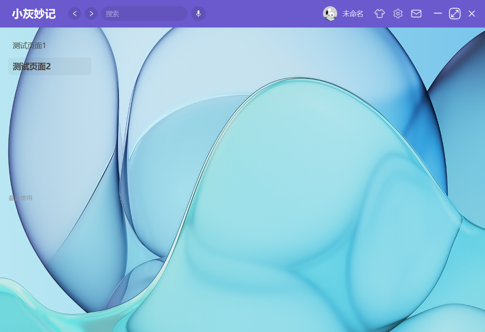

# PySide6 app framework

# 安装库
```shell
pip install app-page
```
# 模块说明
- core        程序核心模块
- animation   动画模块
- plugins     插件模块
- utils       工具模块

# 使用案例
```python
from app_page import Page, createApp

"""
SETTING (dict): 设置参数
    stack_id (str): 栈组件id
    pages (dict): 页面字典
    pageOptionList (list): 页面配置项列表
    button_frame_id (str): 按钮框架id
    button_container_id (str): 按钮容器id
    button_close_id (str): 关闭按钮id
    button_login_id (str): 登录按钮id
    button_name_id (str): 按钮名称id
    APP_ICON_PATH (str): 应用图标路径
    APP_TITLE (str): 应用标题
    APP_VERSION (str): 应用版本
    IS_DEBUG (bool): 是否调试模式
    PING_HOST (str): 网络连接检查地址
    tips_ui (str|Ui_Form): 提示提示消息ui路径或Ui_Form类
    tipsBox_ui (str|Ui_Form): 提示提示框ui路径或Ui_Form类
    loading_icon (str): 加载图标路径
    small_page_icon (str): 缩小图标路径
    maximize_page_icon (str): 最大窗口图标路径
"""
createApp(SETTING={})
```
# 自定义页面
```python
from app_page import Page, EventBus, createApp

# 编辑页面
class Editor(Page):
  def __init__(self):
    super().__init__("editor")
    self.template = """
    <template>
      <div style="color:#333;background-color:#fff;border-radius:10px;" height="250">
        <layout type="QVBoxLayout">
          <label text="写点东西吧(自动保存)" style="font-size:20px;color:#333;" />
          <text-edit id="editor" style="background-color:#e0e0e0;border-radius:10px;padding:10px;font-size:16px;" />
          <button id="help" text="使用说明" height="32" width="100" style="background-color:#000;color:#fff;border-radius:10px;" />
        </layout>
      </div>
    </template>"""

  def show(self, *args):
    self.widgetIdMap["editor"].setPlainText(self.localStore.get("editor-value", ''))
    eventBus = EventBus(self.widgetIdMap)
    eventBus.register("editor", 'textChanged', lambda *args: self.textChange())
    eventBus.register("help", 'clicked', lambda *args: self.tips('没别的说明了，自己摸索一下', 'success'))

  def textChange(self):
    self.localStore.set("editor-value", self.widgetIdMap["editor"].toPlainText())

# 设置页面
class Setting(Page):
  def __init__(self):
    super().__init__("setting")
    self.template = """
    <template>
      <div style="color:#333;background-color:#fff;border-radius:10px;">
        <v-box>
          <label text="系统设置" style="font-size:20px;color:#333;" />
        </v-box>
      </div>
    </template>"""

# 创建应用
createApp(SETTING={
  "APP_TITLE": "桌面软件",
  "pages": {"editor": Editor, "setting": Setting},
  "pageOptionList": [
    {
      "name": "随心笔记",
      "id": "editor",
      "filter": "leftBar",
      "stack_id": "app_page_editor",
    },
    {
      "name": "系统设置",
      "id": "setting",
      "filter": "leftBar",
      "stack_id": "app_page_setting",
    }
  ],
})
```
# 运行结果
